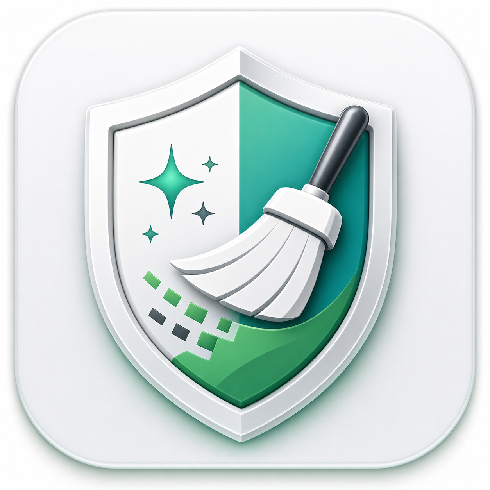

<p align="center">
  
</p>

# VigClean

VigClean is a native macOS cleaner built with SwiftUI. It helps users understand what is taking space on their Mac, review cleanup targets in detail, and delete only the files they intentionally select.

The app focuses on practical cleanup work instead of a one-click black box: it separates system cleanup, installed applications, and disk analysis into dedicated workflows so each scan is scoped to the job the user asked for.

## Highlights

- **Native macOS app**: SwiftUI interface, real app bundle, Dock icon, Finder integration, and native app icons.
- **Scoped scanning**: the Clean tab scans cleanup targets; the Apps tab scans installed applications; the Disk tab analyzes storage usage.
- **Review-first deletion**: cache files can be selected quickly, while personal data and developer dependencies are shown for review instead of being removed by default.
- **Tree-style cleanup targets**: each cleanup group can expose the exact folders and files found, making it possible to keep specific paths and delete only selected items.
- **App uninstaller**: lists apps from `/Applications` and `~/Applications`, shows icons and bundle identifiers, and can remove related support data.
- **Messaging app cleanup**: detects local data for Zalo, Telegram, WhatsApp, Signal, Discord, Slack, Messenger, LINE, Viber, Skype, and WeChat.
- **Disk analysis**: summarizes free/used space, breaks usage down by category, and surfaces large items with plain-English explanations and delete guidance.
- **Progress visibility**: long scans report the current action instead of only showing a generic loading state.
- **Multilingual UI**: includes Vietnamese, English, and Japanese language modes.
- **Admin escalation when needed**: regular user files are removed directly; protected locations can request administrator permission only when required.

## Why VigClean Is Different

Many cleaner examples and small open-source utilities only remove a short hard-coded list of cache folders or provide a simple disk-size browser. VigClean is designed as a more complete maintenance tool:

- It combines cleanup, app uninstall, and disk inspection in one native macOS experience.
- It treats personal app data as high-risk and keeps it unselected by default.
- It understands developer-heavy storage such as Xcode DerivedData, simulator data, Android SDKs, package-manager caches, `node_modules`, build artifacts, and Codex/workspace outputs.
- It scans modern communication apps where local media and chat databases often consume large amounts of disk space.
- It shows what each item is likely used for, whether deletion is safe, and when the item should be reviewed first.
- It avoids forcing every cleanup flow through the same global scan button, keeping each tab responsible for its own work.

The goal is not just to free disk space. The goal is to make macOS storage explainable and give users precise control before anything is deleted.

## Main Workflows

### Clean

Use this tab to scan removable cleanup targets such as:

- user logs and Trash
- browser and app caches
- VS Code cache
- package-manager caches
- npm, npx, Puppeteer, Gradle, CocoaPods, SwiftPM, pip, Poetry, pnpm, and Yarn caches
- Xcode DerivedData and iOS DeviceSupport
- Flutter and local project build outputs
- large installers and archives
- optional high-impact items such as Android SDKs, simulator devices, `node_modules`, and messaging app data

Safe generated files are selected by default. Personal data and project dependencies are listed, but require explicit user selection.

### Apps

Use this tab to browse installed apps with native icons, search by name or bundle identifier, reveal apps in Finder, and uninstall an app together with related local files such as:

- Application Support
- Caches
- Preferences
- Containers and Group Containers
- Logs
- Saved Application State
- WebKit and HTTP storage

When removing an app, VigClean can quit the affected app process before deletion so locked files are easier to remove.

### Disk

Use this tab to understand overall storage usage:

- total disk capacity and free space
- category breakdown by percentage
- largest directories and files
- explanations of what common macOS and app folders are used for
- guidance on whether an item is usually safe to delete, should be reviewed, or should normally be kept

## Build

VigClean requires macOS 14 or later and Swift 6.

```bash
swift build
```

## Run

For development:

```bash
swift run VigClean
```

For a proper macOS app bundle with Dock icon and foreground activation:

```bash
chmod +x Scripts/build-app.sh
Scripts/build-app.sh
open build/VigClean.app
```

## Project Structure

```text
Sources/VigClean/
  CleanupScanner.swift      Cleanup target discovery and deletion
  DiskAnalyzer.swift        Disk usage analysis and item classification
  CleanerViewModel.swift    App state, scan actions, delete actions
  CleanerView.swift         SwiftUI interface
  CleanupModels.swift       Shared data models
  Localization.swift        Vietnamese, English, Japanese UI text
  VigCleanApp.swift         macOS app entry point
  Resources/                App logo and resources
Scripts/
  build-app.sh              Builds the macOS .app bundle
Packaging/
  Info.plist                Bundle metadata
```

## Safety Model

VigClean uses three broad risk levels:

- **Safe**: generated files, caches, logs, and files that apps can usually recreate.
- **Review**: files that are often removable but may affect developer workflows or require re-download/rebuild time.
- **Personal**: app data, chat media, local databases, project dependencies, SDKs, and simulator states that may be important to the user.

The app is intentionally conservative: personal and high-impact data is visible, explained, and left unchecked until the user chooses to remove it.
